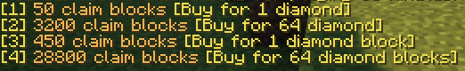
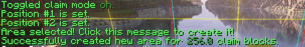
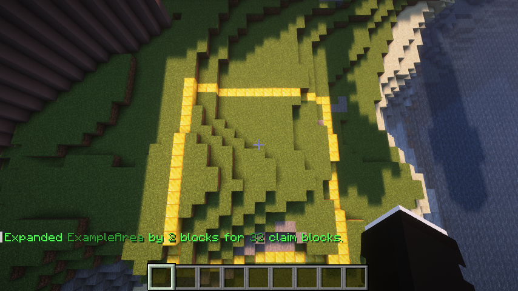
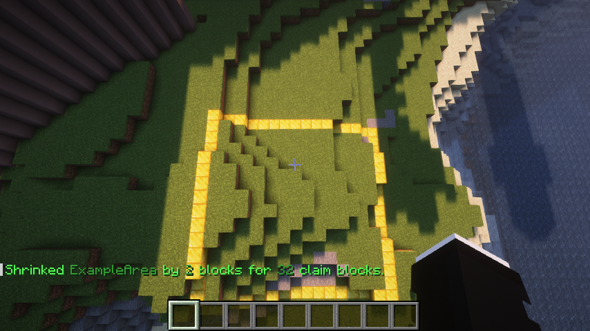

# AreaEssentials

AreaEssentials is a Minecraft claiming plugin that is compatible with BlueMap. It can be used on servers in combination with other plugins.

## Dependencies

AreaEssentials depends on the following plugins:

- [EssentialsAPI](https://github.com/LittleBigOwI/EssentialsAPI)
- [BlueMap](https://bluemap.bluecolored.de/)

The plugin will not load without either of these two plugins. Additionally, it has a soft dependency on the [ScoreboardEssentials](https://github.com/LittleBigOwI/ScoreboardEssentials) plugin. AreaEssentials will still load without ScoreboardEssentials, but warnings may appear in the console and some commands may not work properly. Testing with missing plugins is yet to be done, so it is recommended to use both [EssentialsAPI](https://github.com/LittleBigOwI/EssentialsAPI) and [ScoreboardEssentials](https://github.com/LittleBigOwI/ScoreboardEssentials) plugins for now.

## Commands

### Claims

The `/claim` command allows player access to the claiming menu. By default, it toggles the claiming mode for the player who uses the command. Alternatively, you can use `/claim on` or `/claim off` to specifically set your claiming mode. When the command is successful, the following message will appear in chat:

The `/claim` command also has two other subcommands:

- `/claim shop`: Opens the claim block shop, where players can purchase claim blocks with diamonds. The following example shows four options available for buying claim blocks: 50 claim blocks for 1 diamond, 3200 claim blocks for a stack of diamonds, 450 claim blocks for 1 diamond block, or 28800 claim blocks for a stack of claim blocks.

  

  Note: Players can passively earn claim blocks with playtime, and this can be configured in the `config.yml` file generated by the [EssentialsAPI](https://github.com/LittleBigOwI/EssentialsAPI) plugin. When players passively earn claim blocks, they will receive a message similar to the following:

  

- `/claim blocks`: Displays the amount of claim blocks the player executing the command has. This allows the player to know the size of the claim they can make. When using the command, the player will see the number of claim blocks they possess. Please note that the displayed number in the example image is an absurd amount for demonstration purposes only.

  

### Areas

The `/area` command in this Minecraft plugin provides various features related to areas, but it requires specific arguments to function and will not do anything on it's own. It allows players to access the following area-related features: editing, creating, removing, expanding, shrinking, showing, hiding, and displaying information about other areas.
The `/area` command has multiple subcommands:

- `/area show`: Displays the borders of the player's current area. This command only works when the player is inside one of their own areas.
- `/area hide`: Hides the borders of the player's current area. This command has the same effect as the `/area show` command but hides the borders instead.
- `/area info`: Displays information about an area, including the owner's name and the area's creation date. See the example image below:

  

- `/area create`: Creates an area after the player has selected two area corners using the `/claim` command. The command has an optional syntax: `/area create [Optional:areaName]`. If the `areaName` argument is specified, the area will be given that name upon creation. Otherwise, an automatically generated name will be assigned, combining the player's username and the area's number. Note that a player cannot have two areas with identical names. The example image below demonstrates the process of creating an area:

  

  Minimum area sizes can be configured in the `config.yml` file generated by the [EssentialsAPI](https://github.com/LittleBigOwI/EssentialsAPI) plugin. In this example, the minimum area size is set to 16 by 16, which equals an area of 256 claim blocks.

- `/area remove [areaName]`: Allows players to delete their areas by specifying a valid name.
- `/area expand [amount]`: Enables the owner of an area to expand its size by a specified amount of claim blocks. The area expands in the direction the player is looking. For example, if the player executes the command `/area expand 2` while inside their area and looking in the desired direction, the area will expand accordingly. See the image below for an example:

  

- `/area shrink [amount]`: Works similarly to `/area expand [amount]`, but instead of expanding the area, it shrinks it. The claim blocks used for the previous expansion are returned to the player. Executing `/area shrink 2` while inside the area and looking in the correct direction will shrink the area accordingly. See the image below for an example:

  

- `/area edit color [color]`: Allows players to edit the BlueMap color of their area. The color should be specified using the HEX format. By default, the area color matches the player's current rank.
- `/area edit name [name]`: Allows players to edit the name of their area.
- `/area edit joinMessage [set/remove] [message]`: Enables players to edit the message displayed at the action bar level when other players enter their area.
- `/area edit leaveMessage [set/remove] [message]`: Similar to `/area edit joinMessage [set/remove] [message]`, but for the message displayed when players leave the area.
- `/area edit permissions [permission] [true/false]`: Allows players to edit the permissions for their area. Existing permissions include:
  - `mobGriefing`: Toggles creeper explosions and enderman griefing.
  - `doPVP`: Toggles player versus player

### Warps

A warp is a public home. The plugin is automatically configured for players to have only one warp. They can set their warp anywhere with the `/setwarp [warpName]` command. If in any case a player wants to remove their warp, they can use the `/delwarp` command which doesn't need a warp name since players can only have one. Note that all warps must have a different name so that players won't confuse them. If players want to teleport to a warp, the `/warp [warpName]` command can be used as long as a valid warp name is specified.

## Authors

- [@LittleBigOwl](https://www.github.com/LittleBigOwI)